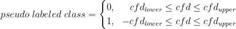

## Environment
* Ubuntu 18.04
* Python 3.6.8
* numpy 1.16.0, pandas 0.24.0, matplotlib 3.0.2
* tensorflow-gpu 1.13.1, keras==2.2.4

## Maintainer Info
* Chin-Ho, Lin
* tainvecs@gmail.com

## Outline
* [Overview](https://github.com/tainvecs/MachineLearning-2017/blob/master/hw4/README.md#overview)
* [Dataset](https://github.com/tainvecs/MachineLearning-2017/blob/master/hw4/README.md#dataset)
* [Experiment](https://github.com/tainvecs/MachineLearning-2017/blob/master/hw4/README.md#experiment)
    - Data Preprocessing
    - Word Embedding
    - Model Architecture
    - Experiment Result (GRU)
    - Experiment Result (LSTM)
    - Best Performed LSTM Model Trained with Dataset Preprocessed in Different Ways
    - Ensemble
    - Semi-supervised Learning
* [Reference](https://github.com/tainvecs/MachineLearning-2017/blob/master/hw4/README.md#reference)

## Overview
In homework 4, we are given twitter dataset with sentiment labels. By training Recurrent Neural Network model, we build a binary classifier to predict the sentiment of test tweets. External datasets are not allowed.

## Dataset

* **Training Data**
	- /data/raw/training_label.txt and /data/raw/training_nolabel.txt
	- size: 200,000 labeled tweets and 1178,614 non-labeled tweets
* **Test Data**
	- /data/raw/testing_data.txt
	- size: 200,000 tweets

* **Validation set**
	- 10\% labeled tweets randomly split and held out from **Training Data**
	- random seed 1234

## Experiment

* **Data Preprocessing**
	* **raw**
		+ raw training tweets
		+ **x_train.all.raw.txt**: raw labeled and non-labeled tweets
		+ **x_train.labeled.raw.txt**: raw labeled tweets
	* **proc**
		+ preprocess data by the predefined dictionary that prune slang and abbreviations
		+ convert numbers '1', '2' and '4' to "one", "to" and "for", and the other numbers as a single token "\_num"
		+ prune mixed or duplicate punctuations and replace them with tokens "\_?", "\_!!!", "\_!!", "\_!", "\_...", "\_.", and "\_,"
		+ prune words with repeating characters that are redundant by counting word frequency and regular expression
		+ lemmatize contraction such as "don\'t" and "ya\'ll"
		+ convert words with order and time suffix to tokens "\_order" and "\_time"
		+ **x_train.all.proc.txt**: labeled and non-labeled tweets that are preprocessed
		+ **x_train.labeled.proc.txt**: labeled tweets that are preprocessed
	* **freq_proc**
		+ further convert words with less than 5 times frequency to token "\_rare"
		+ **x_train.all.freq_proc.txt**: labeled and non-labeled tweets that are preprocessed and rare-word-pruned
		+ **x_train.labeled.freq_proc.txt**: labeled tweets that are preprocessed and rare-word-pruned
	* **stem_frq_pro**
		+ further stems training tweets
		+ **x_train.all.stem_frq_pro.txt**: labeled and non-labeled tweets that are preprocessed, rare-word-pruned and stemmed
		+ **x_train.labeled.stem_frq_pro.txt**: labeled tweets that are preprocessed, rare-word-pruned and stemmed

* **Word Embedding**
	* **FastText** model
	* Parameters
		+ CBOW Model
		+ Vector Dimension: 256
		+ Loss Function: negative sampling
		+ Negative Sample: 5
		+ Window Size: 5
		+ Learning Rate: 0.1
		+ Epoch: 30
		+ Word N-Gram: trigram
		+ Char N-Gram: length 3 to 6

* **Model Architecture**
	* Parameters
		+ RNN Model: **GRU** and **LSTM**
		+ Units (GRU Layers and LSTM Layers): (256, 256)
		+ Units (Dense Layers): (256, 256)
		+ Activation Function (GRU Layers and LSTM Layers): \"tanh \"
		+ Activation Function (Dense Layers): \"selu\" and \"swish\"
		+ Epoch: 20
		+ Batch Size: 64
		+ Optimizer: \"adam\"
    * |  |  |  |
		| :-: | :-: | :-: |
		| GRU |  |  |
		| LSTM |  |  |
	* **GRU** model has less training parameters than **LSTM** model. Therefore, **GRU** model has faster training speed.

* **Experiment Result (GRU)**
    * | Data | Dense Activation | GRU Dropout Rate | Dense Dropout Rate | Accuracy (Validation) |  
        | :-:  | :-:   | -:       | -:       | -:     |
        | raw  | selu  | 0.1, 0.1 | 0.3, 0.3 | 0.8279 |
        | raw  | swish | 0.1, 0.1 | 0.3, 0.3 | 0.8244 |
        | proc | selu  | 0.1, 0.1 | 0.3, 0.3 | 0.8260 |
        | proc | swish | 0.1, 0.1 | 0.3, 0.3 | 0.8287 |
        | raw  | selu  | 0.1, 0.1 | 0.4, 0.4 | 0.8272 |
        | raw  | swish | 0.1, 0.1 | 0.4, 0.4 | 0.8296 |
        | proc | selu  | 0.1, 0.1 | 0.4, 0.4 | 0.8316 |
        | proc | swish | 0.1, 0.1 | 0.4, 0.4 | 0.8280 |
        | raw  | selu  | 0.2, 0.2 | 0.4, 0.4 | 0.8275 |
        | raw  | swish | 0.2, 0.2 | 0.4, 0.4 | 0.8314 |
        | proc | selu  | 0.2, 0.2 | 0.4, 0.4 | 0.8286 |
        | proc | swish | 0.2, 0.2 | 0.4, 0.4 | **0.8327** |
        | raw  | selu  | 0.3, 0.3 | 0.4, 0.4 | 0.8300 |
        | raw  | swish | 0.3, 0.3 | 0.4, 0.4 | 0.8317 |
        | proc | selu  | 0.3, 0.3 | 0.4, 0.4 | 0.8287 |
        | proc | swish | 0.3, 0.3 | 0.4, 0.4 | 0.8311 |

* **Experiment Result (LSTM)**
    * | Data | Dense Activation | LSTM Dropout Rate | Dense Dropout Rate | Accuracy (Validation) |  
        | :-:  | :-:   | -:       | -:       | -:     |
        | raw  | selu  | 0.2, 0.2 | 0.4, 0.4 | 0.8328 |
        | raw  | swish | 0.2, 0.2 | 0.4, 0.4 | 0.8312 |
        | proc | selu  | 0.2, 0.2 | 0.4, 0.4 | 0.8260 |
        | proc | swish | 0.2, 0.2 | 0.4, 0.4 | 0.8287 |
        | raw  | selu  | 0.3, 0.3 | 0.4, 0.4 | 0.8351 |
        | raw  | swish | 0.3, 0.3 | 0.4, 0.4 | 0.8319 |
        | proc | selu  | 0.3, 0.3 | 0.4, 0.4 | 0.8345 |
        | proc | swish | 0.3, 0.3 | 0.4, 0.4 | 0.8322 |
        | raw  | selu  | 0.4, 0.4 | 0.3, 0.3 | 0.8353 |
        | raw  | swish | 0.4, 0.4 | 0.3, 0.3 | 0.8364 |
        | proc | selu  | 0.4, 0.4 | 0.3, 0.3 | 0.8362 |
        | proc | swish | 0.4, 0.4 | 0.3, 0.3 | **0.8368** |
        | raw  | selu  | 0.5, 0.5 | 0.5, 0.5 | 0.8338 |
        | raw  | swish | 0.5, 0.5 | 0.5, 0.5 | 0.8336 |
        | proc | selu  | 0.5, 0.5 | 0.5, 0.5 | 0.8341 |
        | proc | swish | 0.5, 0.5 | 0.5, 0.5 | 0.8340 |
	* Although **GRU** model has faster training speed, **LSTM** model gain better performance in this task.
	* Generally, using \"swish\" activation function with batch normalization gain better result than using \"selu\" activation function.
	* Dropout layers prevent model from overfitting, and produce sort of ensemble effect. Applying dropout layers reaches higher validation accuracy in this task.
    * |  |  |  |
        | :-: | :-: | :-: |
        | **LSTM Dropout Rate** | **Dense Dropout Rate** | **Learning Curves** |
        | 0.2 | 0.4 |  |
        | 0.4 | 0.3 |  |
        | 0.5 | 0.5 |  |
    * From learning curves, higher dropout rate prevent overfitting but also slow down the speed of convergence. Too large dropout rate might also limit the performance of models.

* **Best Performed LSTM Model Trained with Dataset Preprocessed in Different Ways**
    * | Data | Activation | LSTM Dropout Rate | Dense Dropout Rate | Accuracy (Validation) |  
        | :-:          | :-:    | -:       | -:       | -:     |
        | raw  		   | swish  | 0.4, 0.4 | 0.3, 0.3 | 0.8364 |
        | proc 		   | swish  | 0.4, 0.4 | 0.3, 0.3 | **0.8368** |
        | freq_proc    | swish  | 0.4, 0.4 | 0.3, 0.3 | 0.8345 |
        | stem_frq_pro | swish  | 0.4, 0.4 | 0.3, 0.3 | 0.8329 |
	* FastText model benefit from character-based N-grams model and is able to encode similar-spelling words with high similarity vectors.
	* Tweets have a lot of duplicate character words, concatenated words and misspelled words. Character-based N-gram model is a choice to deal with these problems.
	* Treating rare words as a single word token "\_rare" does not show better performance.
	* Data pruning is a double-edged sword that reduce the noise but also lost information in raw data.

* **Ensemble**
    * Ensemble: Bagging
    * Ensemble all the LSTM and GRU models reach 0.8438 validation accuracy.
    * Ensemble all models that perform better than 0.83 validation accuracy achieve **0.8450** validation accuracy.

* **Semi-supervised Learning**
    * Semi-supervised Learning: Self-training
    * For each input data , the ensemble model predict the probabilities of classes  where **n** is the dimension of input data.
    * We use  as a confident value and pseudo label the unlabeled dataset.
    * 
    * where  and  are the upper and lower bounds, respectively.
    * We train LSTM model on "proc" labeled and pseudo labeled training data with best performed parameters in previous experiments.
    * |  |  |  |  |
        | :-: | :-: | :-: | :-: |
        | ** lower bound** | ** upper bound** | **Validation Accuracy** | **Learning Curves** |
        | 0.95 | 1.0 | 0.8336 |  |
        | 0.7 | 1.0 | 0.8350 |  |
        | 0.5 | 0.7 | 0.8406 |  |
        | 0.3 | 0.7 | **0.8427** |  |
    * Pseudo labeling with higher  and  seems to gain \"easier cases\" for the LSTM model. These \"easier cases\" seems not able to provide new information for LSTM model training and the performance does not improve.
    * Benefit from those low  pseudo labeled data, the performance is able to improve. The learning curves tend to be steeper in first few epochs. It shows that the LSTM model does not perform well on those data, yet learns and improves by training with them.
    * The LSTM model might just learn to do similar prediction with the ensemble model.
    * We also try to ensemble with models trained with pseudo labeled data. The performance shows no improvement and is limited to **0.8450** validation accuracy.

## Reference
* [RNN Slide](http://speech.ee.ntu.edu.tw/~tlkagk/courses/ML_2016/Lecture/RNN%20(v2).pdf)
* [Ensemble Slide](http://speech.ee.ntu.edu.tw/~tlkagk/courses/ML_2016/Lecture/Ensemble%20(v6).pdf)
* [Semi-supervised Learning Slide](http://speech.ee.ntu.edu.tw/~tlkagk/courses/ML_2016/Lecture/semi%20(v3).pdf)
* [Understanding LSTM Networks](http://colah.github.io/posts/2015-08-Understanding-LSTMs/)
* [Stacked Long Short-Term Memory Networks](https://machinelearningmastery.com/stacked-long-short-term-memory-networks/)
* [How to use return_state or return_sequences in Keras](https://www.dlology.com/blog/how-to-use-return_state-or-return_sequences-in-keras/)
* [The curious case of the vanishing & exploding gradient](https://medium.com/learn-love-ai/the-curious-case-of-the-vanishing-exploding-gradient-bf58ec6822eb)
* [Sentiment analysis on Twitter](https://pageperso.lis-lab.fr/benoit.favre/dl4nlp/tutorials/03-sentiment.pdf)
* [Gensim](https://radimrehurek.com/gensim/models/fasttext.html#gensim.models.fasttext.FastText)
* [FastText](https://fasttext.cc/docs/en/unsupervised-tutorial.html)
* [Tweets Data Preprocessing](https://github.com/victoresque/ML2017FALL/blob/master/hw4/util.py)
* [Where does the error come from](http://speech.ee.ntu.edu.tw/~tlkagk/courses/ML_2016/Lecture/Bias%20and%20Variance%20(v2).pdf)
* [Understanding the Bias-Variance Tradeoff](https://towardsdatascience.com/understanding-the-bias-variance-tradeoff-165e6942b229)
